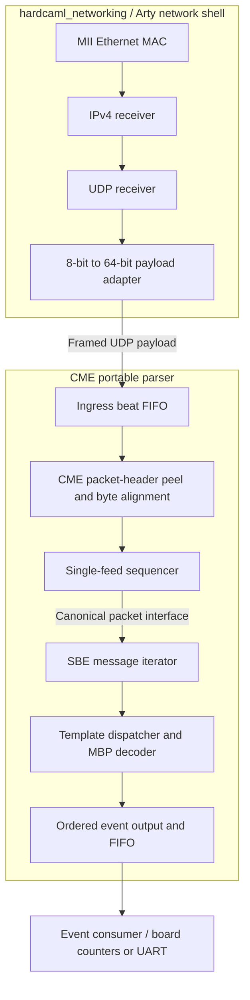

# CME MDP 3.0 Single-Feed 10G Parser

## Summary

Build a clock-portable Hardcaml parser core for one CME multicast channel and one
feed, starting at a 64-bit UDP-payload stream. The production target is one beat
per cycle at 156.25 MHz (10 Gb/s); functional board bring-up will use the same
stream contract at the Arty's 25 MHz application clock behind
`hardcaml_networking`'s byte-to-word adapter. The core will parse the MDP packet
header, validate packet sequencing, iterate multiple SBE messages, decode
incremental MBP entries from a pinned CME production schema, and emit fixed-width
normalized events.

The architecture will preserve a packet-level seam where the single-feed
sequencer can later be replaced by an A/B feed arbiter. The message iterator, SBE
decoder, schema generator, golden model, and normalized-event consumer will remain
unchanged when the second feed is added.

V1 explicitly excludes Ethernet/IP/UDP parsing inside the parser core, production
MAC/PCS integration, order-book state, recovery protocols, multiple CME channels
per instance, and A/B arbitration. A thin Arty integration harness is in scope as
a functional test vehicle, not as evidence of 10G timing or throughput.

## Interfaces and behavior

### UDP payload input

Use the application-stream contract exposed by `Udp_rx_64_mac_top`, introduced by
`hardcaml_networking` commit `dc5912a` and merged into `main` by `4109a4a`:

- Parser `data_i[63:0]` connects to `app_tdata_o`; lane 0 (`data[7:0]`) is the
  earliest UDP payload byte.
- Parser `keep_i[7:0]` connects to `app_tkeep_o`; non-final beats are `0xff`, and
  a partial final beat has contiguous valid bits starting at bit 0.
- Parser `valid_i`, `first_i`, and `last_i` connect to `app_tvalid_o`,
  `app_tfirst_o`, and `app_tlast_o`. Parser `ready_o` drives
  `app_tready_i`. A beat transfers only on `valid_i && ready_o`.
- `first_i` and `last_i` are beat qualifiers, remain stable with the data while a
  beat is stalled, and may both be asserted for a single-beat datagram. Do not use
  `app_start_o` as framing input; it is only a one-cycle accepted-first-beat event.
- Add synchronous `clock_i`, `reset_i`, and `en_i`. In the Arty wrapper these
  use the shim's `tx_clock_i`, `tx_reset_i`, and `en_i`; a future 10G shell drives
  the parser directly in its 156.25 MHz application domain.
- One parser instance represents one independently sequenced CME channel; feed
  source is fixed to A in v1.

Support arbitrary bubbles, back-to-back packets, single-beat packets, and every
message alignment within a 64-bit beat. Assert in simulation that `keep_i` is
nonzero, full on non-final beats, and contiguous from bit 0 on the final beat.

The 64-bit RX top also exposes per-datagram `src_port_o`, `dst_port_o`, `udp_length_o`,
`payload_length_o`, `udp_checksum_o`, `src_ip_o`, and `dst_ip_o`. These are not required by
the CME parser and remain wrapper-level observability signals in v1. In
particular, the current networking stack forwards all destination ports during
bring-up, so the host test sender or wrapper is responsible for selecting the
intended traffic.

The sibling repository generates this shell as
`hardcaml_udp_rx_64_with_mac.v` with:

```sh
dune exec lib/common/generate.exe -- udp-rx-64
```

### Network error and timestamp boundary

Do not put the current shim's status signals directly on the parser's beat
interface:

- `checksum_ok_o` reports the IPv4 header checksum; UDP checksum verification is
  currently a stub despite the raw `udp_checksum_o` field being exposed.
- `crc_error_o` is updated with the later `rx_frame_done_o` pulse, after payload
  `app_tlast_o`. It cannot be sampled on the final payload beat or used to retract
  already emitted cut-through events.
- `ip_busy_o` and `udp_busy_o` are application-domain observability only.
  `frame_crc_ok_o`, `in_payload_o`, and `frame_done_o` are MAC receive-domain
  status, not application-stream sideband.

The portable parser therefore trusts that each delivered UDP payload is valid.
The Arty harness may count and display late CRC/IP errors separately, but parsed
events are intentionally provisional on that development path. A production
network shell must validate before presenting a packet, or buffer the packet until
its final verdict, and translate rejected frames into shell-level counters.

Keep `ingress_timestamp_i[63:0]` as a parser-side packet context input sampled on
the accepted first beat and propagated to events. The Arty wrapper ties it to zero
because `Udp_rx_64_mac_top` has no timestamp output; a future 10G shell may supply
a hardware timestamp without changing the parser or normalized-event interfaces.

### Sequencer control

Expose synchronous control inputs and one output:

- `session_reset_i`: clear sequence initialization and channel validity; the next
  valid packet establishes the baseline.
- `resync_valid_i` and `resync_next_seq_i[31:0]`: atomically restore the expected
  packet sequence and mark the channel valid after external recovery.
- Controls are accepted only while the packet input is idle; expose
  `control_ready_o`. `session_reset_i` takes priority over `resync_valid_i` if
  both are asserted on the same accepted control cycle.

Sequence behavior:

- The first packet after `session_reset_i` is accepted and establishes
  `expected_seq = observed_seq + 1`.
- The expected packet advances the sequence normally.
- A forward gap emits a diagnostic before that packet's decoded events, marks the
  channel invalid, advances expected sequence past the observed packet, and
  continues parsing.
- A duplicate or late packet emits a diagnostic and drops the complete packet.
- Compare sequence numbers modulo 32 bits using the signed delta from
  `expected_seq`; explicit `session_reset_i` handles CME's weekly sequence reset.
- Channel validity remains false after a gap until `session_reset_i` or
  `resync_valid_i`.

### Normalized output

Use one ordered event stream with `event_valid_o`, `event_ready_i`, and a
fixed-width `event_o` payload. An event transfers on
`event_valid_o && event_ready_i`, and the payload remains stable while stalled.
Event kinds are:

- `Mbp_update`
- `End_of_event`
- `Diagnostic`

Every event carries:

- Ingress timestamp
- One-bit source ID (`0` = feed A, `1` = feed B), tied to `0` in v1
- Packet sequence number and CME sending time
- Template ID, schema ID, and schema version
- Transaction time when present
- Current channel-valid state

`Mbp_update` additionally carries:

- Entry index and entry count
- `SecurityID`
- `RptSeq`
- Signed price mantissa and `price_is_null`; retain the CME fixed exponent rather
  than performing decimal arithmetic in RTL
- Signed entry size and null flag
- Signed number of orders and null flag
- Price level
- Update action
- Entry type
- Signed tradeable size and null flag
- Raw `MatchEventIndicator`
- `message_last`

Emit one `Mbp_update` per `NoMDEntries` element. Emit an explicit `End_of_event`
after a message whose `MatchEventIndicator` bit 7 is set, including a legal
zero-entry message.

Diagnostic codes include:

- Sequence gap
- Duplicate or late packet
- Truncated packet header
- Invalid message size
- Message extending beyond packet boundary
- Unsupported template
- Schema incompatibility
- Reserved or invalid enum value
- Internal overflow

Diagnostics retain packet position ordering relative to market events. Malformed
messages are skipped using `MsgSize` when trustworthy; an untrustworthy size or
packet truncation drops the remainder of that packet.

## Implementation

### System hierarchy and ownership

The network shell delivers framed UDP payloads. `Udp_rx_64_mac_top` already
removes Ethernet/IP/UDP headers and packs payload bytes into 64-bit beats; no
additional UDP payload extractor is needed in this repository. The first
protocol-specific extractor here removes the CME packet header inside that
payload.



The diagram shows the data path. Ready propagates upstream; packet context and
ordered diagnostics travel with the corresponding work. The byte aligner is a
shared parser primitive used for packet and message extraction, not necessarily
a separate registered stage at each use.

| Boundary or component | Owner and responsibility |
| --- | --- |
| Ethernet/IP/UDP receive and Arty width adaptation | `hardcaml_networking`; protocol removal and payload packing |
| Traffic selection, network validation, timestamps, and receive overflow | Network shell / integration wrapper; production validation must satisfy the trusted-payload contract |
| Payload contract, elastic storage, and byte alignment | CME core; preserve bytes, framing, and context under backpressure |
| CME packet-header peel | CME core; extract `MsgSeqNum` and `SendingTime`, retain the remaining SBE bytes |
| Sequencing and canonical packet interface | CME core; v1 sequencer is replaceable by a future A/B arbiter |
| SBE iteration, schema decoding, and ordered events | CME core; independent of the network shell and board |
| Arty wiring, counters, and UART observation | Board integration harness beside the networking harnesses; consumes generated CME RTL |

Phase 0 turns these logical blocks into named modules and concrete Hardcaml
records. Keep the portable core independent of networking and board libraries;
the integration harness composes the generated components. Generic parser
primitives may be extracted into a shared library later when another consumer
establishes a common contract.

### Streaming packet and message pipeline

- Replace the current 512-bit stub with a 64-bit streaming core and bounded
  ready/valid elasticity.
- Define the Hardcaml input/output records with directions matching the concrete
  contract above: stream data/qualifiers and controls are inputs; stream ready,
  control ready, and normalized events are outputs. Do not retain the draft
  `ready_i`, `valid_o`, or `control_ready_i` ports.
- Parse the 12-byte CME MDP 3.0 packet header at the start of each UDP payload
  into packet metadata: `MsgSeqNum` and `SendingTime`.
- Place the single-feed sequence block immediately after header extraction. Define
  its output as the canonical packet interface that a future A/B arbiter must also
  produce.
- Parse each message's 10-byte prefix: `MsgSize`, `BlockLength`, `TemplateID`,
  `SchemaID`, and `Version`.
- Iterate messages until the UDP payload ends. Require `MsgSize >= 10` and prevent
  any message from crossing the accepted `last_i` boundary.
- Skip unsupported templates by their declared `MsgSize` and emit one diagnostic,
  allowing later messages in the same packet to be decoded.
- Use a two-beat byte aligner and schema-sized root/group collectors. Do not
  introduce a packet-wide or 512-bit barrel shifter.
- Begin parsing cut-through as soon as the required bytes are available. Add
  elastic beat and event FIFOs so output backpressure propagates safely to input
  `ready`.
- Parameterize FIFO depths for later platform tuning; use 64 input beats and 16
  output events as the portable-core defaults.

### Phased delivery plan

Each checkbox is an implementation milestone, not a claim that the work already
exists. Complete the phase's exit criteria before marking it done. Tests land
with the component they exercise; phase 6 adds system-level evidence rather than
postponing all verification until the end. Follow the [formatting guide](formatting_guide.md)
and [project conventions](hardcaml_project_conventions.md) for new source.

| Phase | Deliverable | Prerequisite |
| --- | --- | --- |
| 0 | Frozen contracts, module hierarchy, and buildable replacement for the stub | Existing plan |
| 1 | Tested streaming and byte-alignment foundation | 0 |
| 2 | CME packet-header extraction and single-feed sequencing | 1 |
| 3 | Generic SBE message iteration and recovery | 2 |
| 4 | Pinned schema, descriptor generator, and independent golden decoder | 0; may proceed alongside 1–3 |
| 5 | MBP decoding and complete normalized event output | 3 and 4 |
| 6 | Integrated conformance, throughput, latency, and RTL checks | 5 |
| 7 | Arty end-to-end functional acceptance | 5; v1 completion also requires 6 |

#### Phase 0 — Contracts, hierarchy, and stub replacement

Completed 2026-09-05. The [Phase 0 contract supplement](phase0_contracts.md)
records the chosen semantics, module ownership, provisional event ABI, and
verification evidence. The generated top is intentionally inactive.

Goal: make the module boundaries and their observable behavior precise enough
that subsequent blocks can be implemented and tested independently.

- [x] **0.1 — Freeze public contracts.** Define the parser `I`/`O` records from
  the interface sections above, including event backpressure and sequencer
  controls. Specify reset priority, behavior when `en_i` is low, and how transfers
  are suppressed during reset/disable. Resolve simultaneous control requests and
  packet arrival, including what "input idle" means with buffered packets.
- [x] **0.2 — Model hierarchy and internal contracts.** Assign module/file names
  to the logical blocks above. Define direction-neutral beat, packet-context,
  message-context, and event records. Specify the canonical post-sequencer packet
  interface: header removed, first remaining byte aligned to lane 0, packet
  boundaries preserved, and metadata associated atomically with its packet.
  Include sequence, sending time, ingress timestamp, source ID, and channel
  validity. Define how header-only packets are represented when no body beat
  exists, and when each block owns or releases packet context.
- [x] **0.3 — Freeze ordering and error rules.** Specify packet draining on drops,
  metadata stability through stalls, diagnostic/event ordering, and values or
  presence flags for context unavailable on early errors. Reserve event kinds and
  diagnostic codes now; list schema-dependent field widths to finalize in phase
  4. Review the one-beat-per-cycle and event-output budgets, including transitions
  between packets and messages, before choosing state-machine boundaries.
- [x] **0.4 — Replace the draft top.** Remove the obsolete ports, constant
  512-bit output, and dummy circuit in `lib/cme/cme_feed_parser.ml`. Introduce a
  buildable top with the agreed interfaces and hierarchy entry points. Until
  processing exists, expose explicit inactive behavior (`ready_o = 0`, no valid
  events) so the skeleton cannot silently accept and discard payloads. Keep the
  pass-through fixture separate from the public normalized-event interface.
- [x] **0.5 — Establish the build/test entry points.** Add a generator target
  producing `cme_mdp3_feed_parser.v` alongside the existing UART target. Convert
  the CME checks to active Dune inline suites using the shared Step/Cyclesim fixture,
  typed observations, named unit tests, deterministic Quickcheck properties, and
  reviewed expect traces from [test_architecture.md](test_architecture.md).
  Retain native OCaml structural tests for ports, event ABI, configuration, and
  circuit-database hierarchy. Superseded assertion executables compile but do
  not run under `runtest`. Record the formatter and verification commands.
- [x] **0.6 — Separate backend evidence.** Keep optional `dune build @rtl-check`
  for Yosys `hierarchy -check` and Icarus Verilog elaboration. Device reporting
  belongs to the explicit OCaml `synthesis/xilinx_reports.exe` command described
  in [hardcaml_reports.md](hardcaml_reports.md); ordinary `runtest` requires none
  of these external tools. The inactive top is a generator smoke target only.

Exit criteria: named hierarchy and contract records are reviewable; unresolved
schema widths are explicitly recorded; the replacement top builds and generates
RTL with the expected port names/directions; `dune runtest` executes the active
Phase 0 inline suite. The generated top is clearly identified as an inactive
skeleton.

#### Phase 1 — Streaming foundation and byte alignment

Completed 2026-09-05. The [Phase 1 implementation record](phase1_streaming.md)
defines the byte-window consumption contract and records the fixture, cycle-rate,
and RTL verification evidence. The public parser top remains inactive pending
protocol-stage integration.

Goal: move framed payload bytes correctly before interpreting CME fields.

- [x] **1.1 — Build the stream fixture.** Add byte-string packet sources and
  scoreboards for low-byte-first words, `keep_i`, `first_i`, and `last_i`, with
  deterministic and randomized stalls and bubbles. Include exact Arty shim
  signal mapping and byte-source-like gaps.
- [x] **1.2 — Implement elasticity.** Build the parameterized ingress beat FIFO
  and reusable event FIFO, using the planned 64-beat and 16-event defaults. Carry
  framing and sampled packet context with buffered data and test full/empty
  transitions and simultaneous enqueue/dequeue.
- [x] **1.3 — Implement byte access.** Build the accepted-byte offset tracker and
  two-beat aligner, with an explicit consume/advance contract. Handle offsets
  0–7, partial final beats, same-beat first/last, and packet boundaries without
  borrowing bytes from the next packet.
- [x] **1.4 — Prove the contract.** Assert valid-lane rules, stall stability, and
  transfer-driven state changes. Exercise reset/disable as specified in phase 0.
  Run the FIFO/aligner through a pass-through fixture and compare all bytes and
  packet boundaries with the input. Use per-DUT Step suites for ingress/event
  FIFOs and the byte aligner, plus a separate transport integration suite. Sources
  hold unaccepted offers; monitors score transfers before the edge and state
  changes after the edge. Scenarios must drain within explicit timeouts.
- [x] **1.5 — Migrate verification and reporting.** Preserve all original Phase 1
  monitor/scoreboard assertions in active coverage, add deterministic generated
  properties and compact reviewed goldens, and retain compile-only legacy
  harnesses. Register the implemented leaves and transport fixture in the OCaml
  reporting command. Preserve real child hierarchy in RTL/report generation;
  validate project emission, report freshness, and backend failure handling.
  See [Phase 0–1 verification](phase01_verification.md) for coverage and evidence.

Exit criteria: no bytes or boundaries are lost, duplicated, or reordered under
the supported stall patterns; the stream foundation sustains a beat per cycle
when its consumer is ready. These tests establish transport behavior, not CME
decode correctness.

#### Phase 2 — CME packet extraction and sequencing

Completed 2026-09-05. The [Phase 2 implementation record](phase2_packets.md)
documents the canonical packet pipeline, control fence, packet/diagnostic
scoreboard, and verification evidence. The public parser top remains inactive
pending message/event integration; sustained-rate optimization remains Phase 6
work as recorded in the implementation limits.

Goal: turn each UDP payload into packet context and an admitted SBE byte stream.

- [x] **2.1 — Peel the CME header.** Extract the 12-byte packet header and ingress
  context, realign the remaining bytes, and diagnose short headers. Track the
  observed packet boundary from accepted `keep_i`/`last_i`; do not assume a total
  payload length is available at packet start.
- [x] **2.2 — Implement the sequencer.** Cover initialization, normal progression,
  forward gaps, duplicate/late drops, modulo wraparound, channel validity, session
  reset, and explicit resynchronization using the frozen control contract.
- [x] **2.3 — Implement ordered diagnostics and draining.** Emit a gap diagnostic
  before that packet's downstream events; drain rejected packets through their
  final beat. Preserve context while either diagnostics or the body are stalled.
- [x] **2.4 — Verify the canonical interface.** Test short and header-only
  payloads, split header collection, back-to-back packets, stalled metadata/body
  handoff, and controls arriving around packet boundaries. Use a body sink and
  packet/diagnostic scoreboard before the SBE iterator exists.

Exit criteria: admitted packets deliver exactly their post-header bytes and
associated context; rejected packets produce the expected diagnostic without
contaminating the next packet; the canonical interface is usable by phase 3.

#### Phase 3 — Generic SBE message iteration

Completed 2026-09-05. The [Phase 3 implementation record](phase3_messages.md)
defines message body consumption, recovery, decoder completion/abort ordering,
and verification evidence. Template admission is configurable; production schema
selection and decoding remain Phases 4 and 5. The public parser top remains inactive.

Goal: find and bound messages independently of their template-specific contents.

- [x] **3.1 — Read message prefixes.** Parse `MsgSize`, `BlockLength`, `TemplateID`,
  `SchemaID`, and `Version` across every byte alignment. Expose message context and
  a bounded body-consumption contract to a downstream decoder.
- [x] **3.2 — Walk and skip messages.** Advance using `MsgSize`, require a minimum
  of 10 bytes, and stop at the actual packet boundary. Use a test consumer to
  exercise message bodies; skip unsupported templates with one diagnostic.
- [x] **3.3 — Implement structural recovery.** Skip malformed messages only when
  their size is trustworthy; otherwise drain the packet remainder. Serialize
  iterator diagnostics with sequencer diagnostics and downstream events.
- [x] **3.4 — Verify boundaries.** Cover zero/one/multiple messages, partial
  prefixes, invalid sizes, bodies extending beyond a packet, and an unsupported
  message followed by a supported test message, under stalls and bubbles.

Exit criteria: the iterator identifies message boundaries and preserves event
ordering, resumes at the next trustworthy message or packet, and requires no
template-specific offsets to operate.

#### Phase 4 — Schema tooling and independent reference model

Completed 2026-09-05. The [Phase 4 implementation record](phase4_schema.md)
pins Production schema ID 1/version 13, selects template 46, records the finalized
event-field encodings, and documents the generated descriptor, XML-driven golden
decoder, PCAP path, and verification evidence. Phase 5 may now consume these
artifacts without making the software oracle depend on RTL extraction constants.

Goal: establish reproducible field definitions and a software correctness oracle.

- [x] **4.1 — Pin the production schema.** Download and commit `templates.xml`
  with source URL, date, schema ID/version, and SHA-256 digest. Confirm the chosen
  `MDIncrementalRefreshBook` layout and finalize the event field widths, enum
  encodings, null representation, and price exponent identified in phase 0.
- [x] **4.2 — Build the descriptor generator.** Implement the supported XML/SBE
  subset described below using `xmlm`; generate Dune build artifacts and report
  unsupported selected-template constructs with precise errors.
- [x] **4.3 — Build the golden decoder.** Read the pinned XML independently of RTL
  extraction descriptors. Produce normalized events, sequence diagnostics, and
  structural/schema diagnostics from byte strings and PCAP-derived payloads.
- [x] **4.4 — Establish reference fixtures.** Add hand-checked examples plus
  schema-valid synthetic packet generation. Test nulls, signed limits, runtime
  block lengths, appended fields, version rules, and zero-entry messages against
  independently stated expectations.

Exit criteria: the pinned input and generator reproduce the descriptors; the
event layout has no unresolved schema widths; hand-checked fixtures validate the
golden decoder without using generated RTL extraction code as its oracle.

#### Phase 5 — MBP decoding and normalized events

Goal: complete the portable parser's market-data behavior.

- [ ] **5.1 — Decode the selected template.** Implement schema-sized root/group
  collectors and MBP field extraction from generated descriptors. Use runtime
  block lengths and skip the MBO group using its runtime dimensions.
- [ ] **5.2 — Apply schema rules.** Handle compatible extensions, `sinceVersion`,
  null sentinels, signed values, invalid enums, and incompatible schema IDs or
  undersized blocks as specified below.
- [ ] **5.3 — Complete the event stream.** Emit one update per MBP entry with
  packet/message context, entry indices/counts, and `message_last`; emit
  `End_of_event` for bit 7 of `MatchEventIndicator`, including zero-entry messages.
  Merge all diagnostics in packet order and connect the output event FIFO.
- [ ] **5.4 — Verify decoding.** Compare deterministic cases with the golden
  decoder, covering every supported update action/entry type, null and numeric
  limits, group padding/truncation, multiple messages, and downstream stalls.

Exit criteria: the integrated parser emits the expected ordered events for the
deterministic conformance suite and propagates backpressure safely to ingress.

#### Phase 6 — System conformance and performance evidence

Goal: establish the portable core's functional and throughput acceptance evidence.

- [ ] **6.1 — Differential stress tests.** Compare thousands of schema-valid
  randomized packets with the independent model. Mix sequencing faults,
  malformed/truncated packets, reset/resync cases, and randomized backpressure.
  Use the same Step testbenches and typed observations as the unit/expect suites,
  with explicit Quickcheck seeds, trial counts, and validity-preserving shrinkers.
  Save minimized failures as named regressions; add sanitized real-capture replay
  when available without making it a prerequisite.
- [ ] **6.2 — Throughput and latency tests.** Under continuous `event_ready_i`,
  exercise uninterrupted 64-bit traffic and back-to-back legal packet/message
  combinations. Prove no internally generated input stalls or lost events and
  the eight-cycle entry-to-event latency bound in the acceptance criteria.
- [ ] **6.3 — RTL checks.** Generate the full parser hierarchy, check for
  combinational loops and unintended packet-wide muxes, and collect available
  synthesis/resource and timing estimates through the OCaml Xilinx reporting
  command. Keep the Yosys hierarchy and Icarus elaboration smoke checks narrow;
  their success does not establish functional behavior, timing, loop freedom,
  or acceptable mux structure. Record the tool, target, clock constraint, hierarchy
  profile, stage, fresh artifact paths, and limits of each result; defer device-specific place-and-route
  closure until a 10GbE shell is selected.

Exit criteria: the automated conformance, throughput, latency, and RTL checks
pass with recorded evidence. Any missing device timing result is explicit and
does not become a claim of physical 10G timing closure.

#### Phase 7 — Arty integration and functional acceptance

Goal: exercise the parser behind the existing physical UDP receive path.

- [ ] **7.1 — Compose the board harness.** Add the harness beside the networking
  board harnesses, wire `Udp_rx_64_mac_top` to generated CME RTL, share the 25 MHz
  application clock/reset/enable, and tie ingress timestamp to zero. Record the
  networking revision and RTL generation commands used for integration.
- [ ] **7.2 — Add observability.** Expose accepted-packet, decoded-update, parser
  diagnostic, and late-network-error counters or UART records. Select intended
  traffic in the sender/wrapper and keep late CRC/IP status outside parser events.
- [ ] **7.3 — Run the board cases.** Send synthetic MDP payloads in UDP datagrams,
  compare observed counters/events with expected results, and include multiple
  messages, partial final beats, sequence gaps, and duplicate packets.
- [ ] **7.4 — Record acceptance.** Document board setup, sender commands, expected
  observations, and captured results. Record provisional event validity on this
  permissive network path and distinguish board evidence from phase 6 evidence.

Exit criteria: end-to-end board results match the selected synthetic cases.
Harness preparation may start after phase 1 using its fixture, but full v1
completion requires both phase 6 and phase 7 acceptance. Hardware availability
does not prevent completing the portable-core phases.

The Arty adapter emits at most one wide beat per eight accepted byte cycles. This
is useful for end-to-end framing and decode tests but leaves large parser-idle
gaps. Continuous 64-bit simulation plus synthesis/timing checks remain the
acceptance path for 10G throughput.

### Schema generation and reference model

- At implementation time, download the then-current CME Production
  `templates.xml`, commit it with its source URL, download date, schema ID/version,
  and SHA-256 digest.
- Add an OCaml build-time generator using `xmlm`. Generate schema constants and
  decode descriptors into Dune build artifacts rather than maintaining generated
  offsets by hand.
- Support the SBE subset required by CME MBP: primitive integer/character types,
  constants, null sentinels, composites, enums, sets, explicit offsets,
  `sinceVersion`, fixed root blocks, group dimensions, and repeating entries.
- Fail the build with the exact XML construct and template name if the selected
  MBP template uses an unsupported feature.
- Generate only hardware descriptors for the selected `MDIncrementalRefreshBook`
  template in v1, while retaining reusable type parsing for later templates.
- Use runtime root and group `BlockLength` values to locate groups and entries.
  Ignore compatible appended fields instead of assuming the pinned block size.
- Decode schema versions through the pinned version according to `sinceVersion`.
  For a newer version, continue only when known offsets fit within the advertised
  block lengths; emit a schema diagnostic and skip unknown appended tails. Reject
  incompatible schema IDs or undersized blocks.
- Implement the software golden decoder independently from the generated RTL
  extraction code, reading the pinned XML directly. Use it to produce normalized
  events from byte strings and PCAP-derived UDP payloads.

### Future A/B expansion seam

A/B support will add a second header-peel path and per-feed packet buffering before
the existing canonical packet interface:

```text
Feed A header peel + FIFO -+
                           +-- A/B arbiter --> existing message/SBE pipeline
Feed B header peel + FIFO -+
```

The arbiter will replace the v1 single-feed sequencer and own expected-sequence
state, duplicate suppression, future-packet buffering, and gap declaration.
Reserve `source_id` in canonical packet metadata and normalized events in v1,
tying it to feed A, so later events can report which feed won without an SBE or
normalized-event interface change.

A future 100G version may reuse the schema tooling, event types, golden model, and
subsystem boundaries, but widening the input to 512 bits will require a parallel
message-walking/extraction architecture; it is not part of v1.

## Test plan and acceptance criteria

- Use the implemented [test architecture](test_architecture.md): one suite per
  DUT/integration boundary, shared Step/Cyclesim construction, typed observations,
  named inline unit tests, seeded Quickcheck properties, and short expect traces.
  `dune runtest` runs the Phase 0–3 suites. Add later-phase tests to this
  architecture, keeping independent software expectations and bounded draining.
- Run the optional `@rtl-check` alias for Yosys hierarchy resolution and Icarus
  elaboration. Use [OCaml/Dune reports](hardcaml_reports.md) for explicit device
  synthesis/timing; keep both outside functional `runtest`.
- Unit-test the stream aligner at byte offsets 0-7, partial final beats, same-beat
  `first/last`, bubbles, and randomized output backpressure.
- Add a contract test using the exact shim naming and behavior: low-byte-first
  words, `app_tkeep_o`, held `app_tfirst_o/app_tlast_o` under backpressure, and
  wide-beat gaps matching an 8-bit source. The adapter's own packing tests remain
  in `hardcaml_networking`; the parser test verifies the integration boundary.
- Test technical and SBE headers split across every possible beat boundary.
- Test zero, one, and multiple messages per packet; zero, one, and multiple MBP
  entries per message.
- Cover every MBP update action and entry type, all nullable fields,
  minimum/maximum integer values, and explicit appended root/group padding.
- Verify normal sequence progression, first-packet initialization, gaps,
  duplicates, late packets, 32-bit wraparound, session reset, and explicit
  resynchronization.
- Verify malformed sizes, truncated headers/groups, unsupported templates, schema
  mismatches, and invalid enum encodings without losing alignment for subsequent
  valid packets when recovery is possible.
- Differential-test RTL output against the independent golden decoder using
  thousands of schema-valid randomized packets.
- Replay sanitized real CME PCAP payloads when available; real captures supplement
  but do not block the synthetic conformance suite.
- Under continuous `event_ready_i`, accept one 64-bit input beat every cycle for
  back-to-back legal packets without internally generated stalls or lost events.
- Assert `event_valid_o` with the corresponding `Mbp_update` event no later than
  eight 156.25 MHz cycles after accepting the final byte required for that entry,
  provided the output is ready.
- Assert output data remains stable whenever `valid && !ready`.
- Generate synthesizable RTL and check for combinational loops and unintended wide
  packet-level muxes. Device-specific place-and-route timing closure is deferred
  until selection of the 10GbE board shell.
- On Arty, send synthetic MDP payloads inside UDP datagrams and verify packet,
  update, diagnostic, and late-network-error counters. Treat this as functional
  acceptance only; do not derive a 10G throughput claim from the MII test.

## Assumptions and defaults

- V1's portable core consumes trusted UDP payloads; Ethernet FCS, VLAN, IPv4
  fragmentation/checksum, UDP checksum, multicast filtering, and MAC overflow
  handling belong to the network shell. The permissive Arty shell is an explicit
  development exception and reports its late errors out of band.
- The production target clock is 156.25 MHz. The same synchronous RTL may run at
  the Arty's 25 MHz `eth_tx_clk` for functional testing; no CDC is inserted between
  the UDP shim and parser because both application interfaces use that clock.
- The implementation decodes CME's combined `MDIncrementalRefreshBook` message but
  emits only the MBP `NoMDEntries` group; its MBO order group is safely skipped
  using its runtime group dimensions.
- Prices remain signed CME mantissas with explicit null flags; no scaling,
  floating-point conversion, symbol lookup, or order-book mutation occurs in the
  parser.
- A gap invalidates channel correctness but does not stop structural decoding.
- Finite buffering cannot guarantee losslessness under unbounded downstream
  stalls. The portable core backpressures correctly; the future MAC shell must
  size ingress buffering and count/report physical receive overflow.
- CME's packet header, message header, little-endian encoding, repeating-group
  layout, and schema-extension behavior follow the authoritative
  [technical-header][cme-technical-header], [SBE-header][cme-sbe-header], and
  [schema][cme-schema] definitions.

[cme-technical-header]: https://cmegroupclientsite.atlassian.net/wiki/spaces/EPICSANDBOX/pages/457638617/MDP%2B3.0%2B-%2BSBE%2BTechnical%2BHeaders
[cme-sbe-header]: https://cmegroupclientsite.atlassian.net/wiki/spaces/EPICSANDBOX/pages/457325932/MDP%2B3.0%2B-%2BSBE%2BMessage%2BHeader
[cme-schema]: https://cmegroupclientsite.atlassian.net/wiki/spaces/EPICSANDBOX/pages/457225459/MDP-30---Message-Schema
